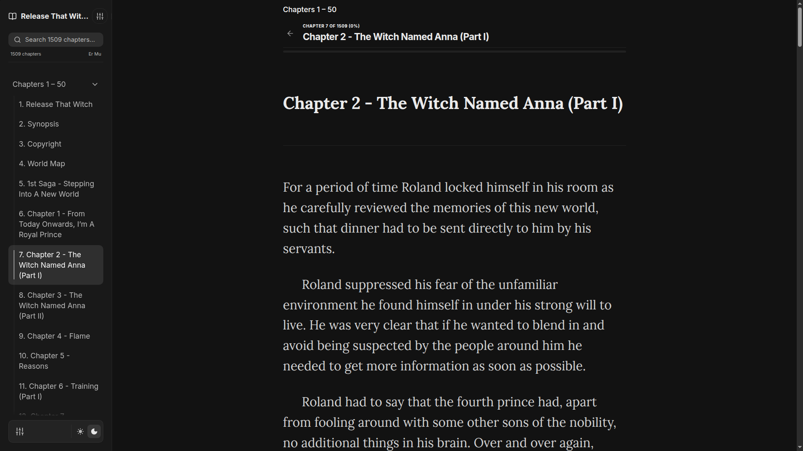
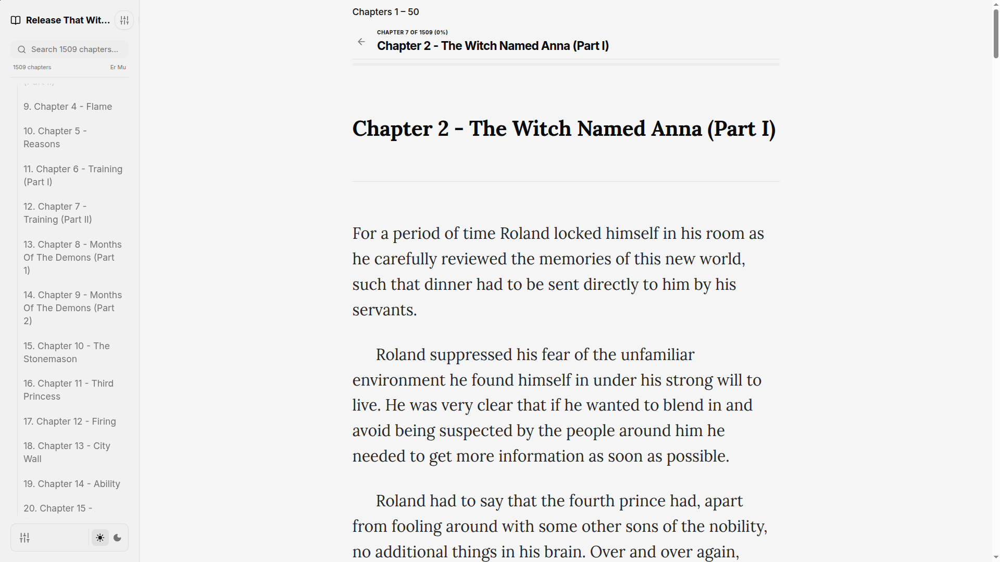
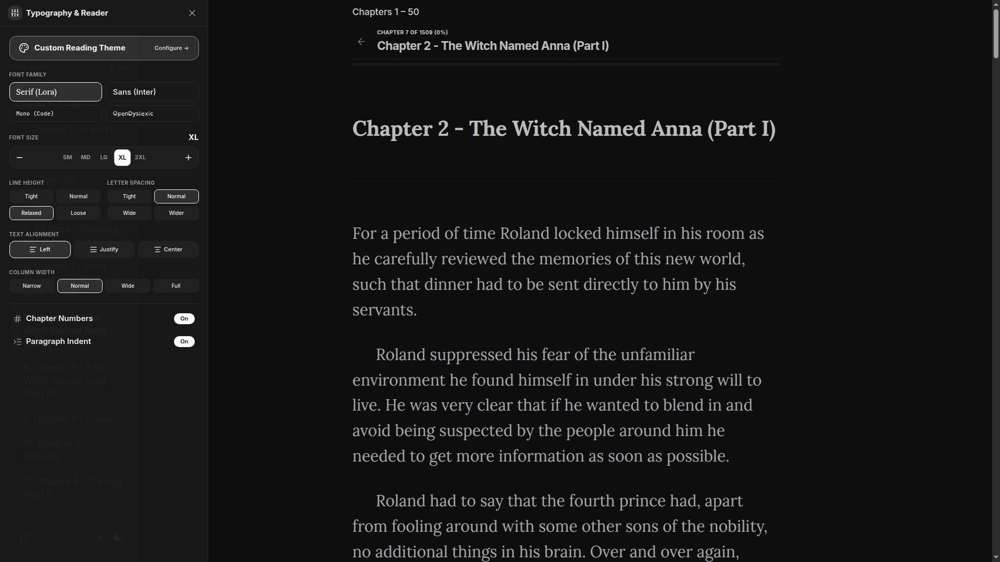
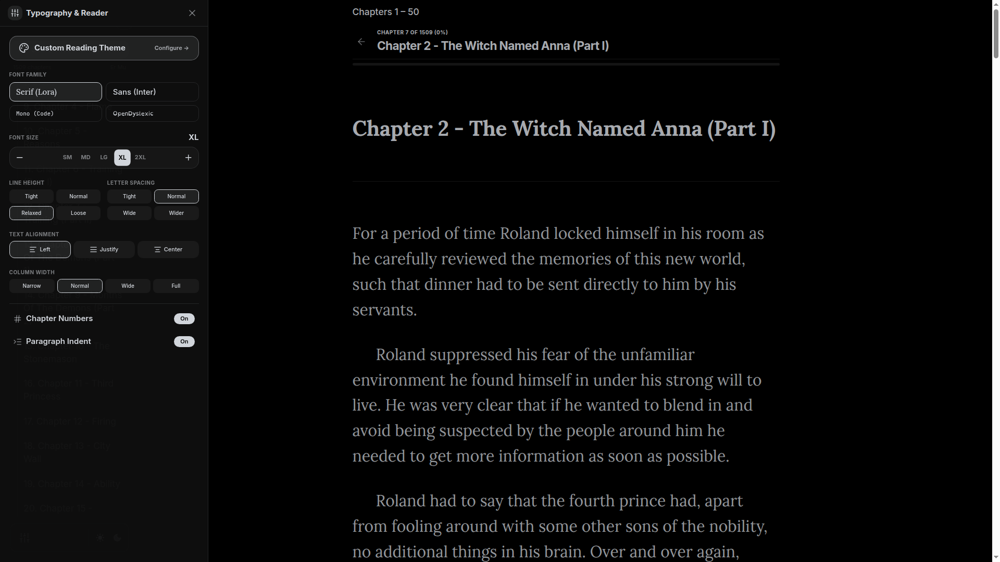
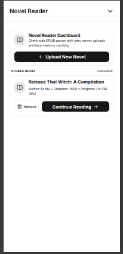
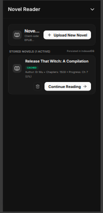
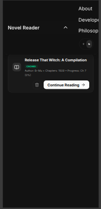
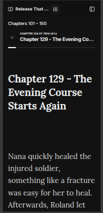
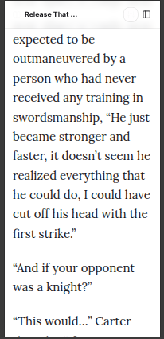

# Showcase

A full visual tour of the EPUB Web Reader. For setup and tech details, see the [README](README.md).

**Live Demo**: [https://epub-web-reader.vercel.app/](https://epub-web-reader.vercel.app/)

---

## Reading View

The reader in dark mode with the chapter sidebar open. Books with more than 60 chapters are automatically grouped into collapsible batches of 50, so a 1500-chapter web novel stays navigable.

The same view in light mode, scrolled further down the table of contents.

---

## Typography & Reader Settings

The settings drawer slides in over the reader so you can see changes land live — font family, size, line height, letter spacing, alignment, column width, two-page mode, and paragraph indentation.

---

## Upload & Library Dashboard

The EPUB is unzipped and parsed entirely in the browser — nothing is uploaded to a server — then cached in IndexedDB so it reopens instantly on your next visit. The stored novel card shows author, chapter count, and reading progress, with one-click *Continue Reading* and *Remove*.

---

## Mobile

The sidebar collapses behind a toggle and the layout reflows to a single column. Reading state, progress, and theme all carry over from desktop.

